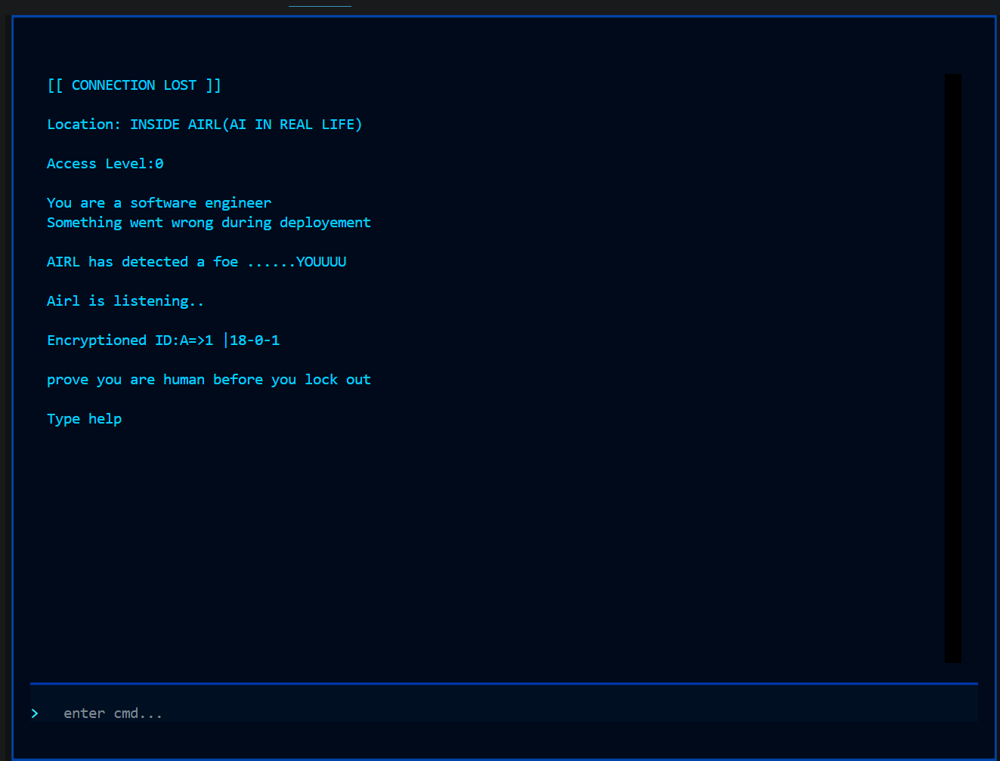

# AItrap1d
It is  a game you can play in the terminal and it follows a command based solving  method to progress up in the story.It has basic things like levels,hints and other cool options.

# How it was built 

It was built using the textual libraries that i learnt partially in my python advance course and i finally tried to follow 

Python was the main mvp here as it dealt with the core logic.

I used CSS for a good styling b/w two modes
{PLS DONT WRITE "creepy" in cmd}

## DASHBOARD 

## MY LEARNING

I LEARNED TEXTUAL EVEN CLEARLY

MY CSS SKILLS ON TEXTUAL WERE LIKE SUCKING BAD SO I GOT HINT OF IT AND WATCHED TUTORIALS TO IMPROVE HIM.

IN PYTHON IDK WHAT TO SAY

## HOW TO PLAY

WATCH THIS VIDEO FOR UNDERSTANDING FEATURES MORE DEEPLY

## RUN

1.DOWNLOAD THE RELEASE FILE AND OPEN IN TERMINAL JUST IT

                       OR

1.DOWNLOAD OR CLONE REPO

2.MAKE SURE YOU HAVE TEXTUAL-8.2.7 INSTALLED OR YOU CAN FACE CSS  ISSUE 
via-pip install textual

3.PYTHON 3.10+

4.run __ app.py

# GOALS

MAKE LEVEL 2 WITH MORE PLOT AND A BIGGER STORYLINE AND IMPROVE IT GREATLY SO IT BECOMES A 50HR PLUS PROJECT(MAYBE:})

# NOTE-

I USED AI IN SOME PLACE OF THE PROJECT YOU CAN TAKE AS 20-25% 

I USED IT MOSTLY FOR DEBUG ONLY AS I AM SOMEONE WHO KNOWS TEXTUAL BUT GET CONFUSED B/W STATIC AND RICHLOG AND SOME PLACE SO I APPLY THINGS ACC. TO ME AND THEY BREAK LOGIC SO FOR THAT I ASKED AI ALSO FOR THE CSS PROBLEM THAT BLEW MY MIND LIKE I CHANGED THE PYTHON BLOCK FOR CREEPY STYLING 5 6 TIMES

I USED IT IN 1 OR 2 THINGS MORE I DONT REMEMBER.

## THANKS TO HORIZON REVIEW TEAM AND MY BRAIN

